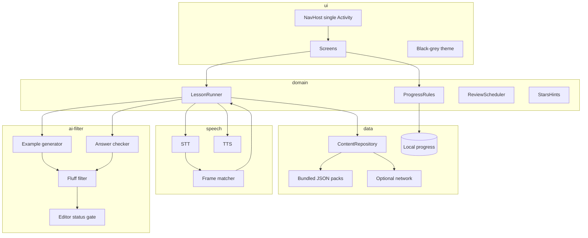
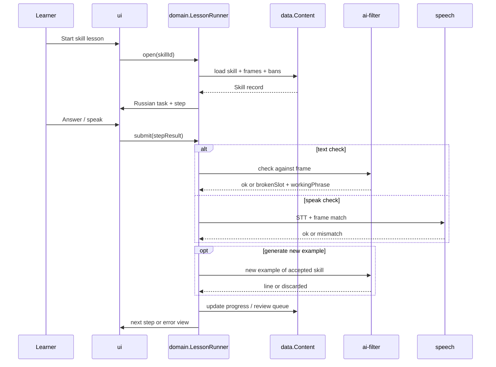

# Architecture (planned Android app)

**Docs only. No application code in this repository.**

Target: Kotlin, Android, **single-activity** app. First language pair: English for Russian speakers. UI and error copy in Russian; target language in drills, listening, and speaking checks.

## Design principles

1. **Offline-first content and progress.** Bundled skill packs and local progress work without network.
2. **Network is optional.** Used for online LLM generation/check and for downloading an offline open model (one button).
3. **Skill engine, not story engine.** Content is skills → frames → slots → bans. Roles are situations with goals.
4. **AI is subordinate.** Generation and checks pass through `ai-filter` before anything reaches the learner.
5. **Dry black-and-grey shell.** Habit UX (short session, skill map, review) without characters, leagues, or plot.

## Layers

| Layer | Responsibility |
| --- | --- |
| `ui` | Compose (or View) screens, navigation, dry theme, Russian chrome |
| `domain` | Lesson orchestration, skill progress rules, stars→hints, review scheduling |
| `data` | Content packs (JSON), local progress store, optional remote download of packs/models |
| `speech` | STT / TTS wrappers; compare utterance to expected frame; no “friend” voice |
| `ai-filter` | Prompt construction within frames; hard fluff discard; editor-status gate |

## Module boundaries (implementation intent)

- **`ui`** depends on **`domain`** only (not on raw network or model SDKs).
- **`domain`** depends on **`data`**, **`speech`**, **`ai-filter`** interfaces.
- **`data`** owns serialization of schemas in [DATA.md](DATA.md) and Room/DataStore (or equivalent) for progress.
- **`speech`** and **`ai-filter`** are swappable backends (online vs on-device) behind the same contracts.
- No feature module should invent “character” or “plot” entities. Situation = `Role` object in [DATA.md](DATA.md).

## Lesson data flow

## Offline vs online

| Capability | Offline | Online |
| --- | --- | --- |
| Bundled skills, letters, cards, kindergarten | Yes | — |
| Progress, review, stars | Yes | Optional sync later (v1: local only) |
| New examples of accepted skills | If offline model installed | Online LLM |
| Answer check / broken-slot note | Rule-based always; model optional | Model optional |
| Goal mini-dialogue | If offline model installed | Online LLM |
| Offline model download | Button in Settings; needs network once | — |

**Decision (documented):** v1 progress is **device-local only**. No account required for stages 0–5. Accounts/sync are out of scope until after fluff-filter acceptance.

## Content packing

- Packs live under documented path convention `content/skills/*.json` (see [DATA.md](DATA.md)).
- App ships a first content pack sized per [BUILD.md](BUILD.md).
- `reviewStatus` and `allowGenerate` gate what AI may expand.

## Non-goals (architecture)

- Multi-activity story flows or narrative lesson graphs.
- Social leagues, friend feeds, character profiles.
- Training or hosting our own LLM weights pipeline.
- Universal chatting tutor API without frames/bans.
- iOS / Apple as a **working** tech-help path (Apple may appear only as dismissed poor gear in role content).
- Rewriting pedagogy into “warm coach” copy in the `ui` layer.

## Related docs

- Screens: [SCREENS.md](SCREENS.md)
- Schemas: [DATA.md](DATA.md)
- Build order: [BUILD.md](BUILD.md)
- Filter rules: [PEDAGOGY.md](PEDAGOGY.md)
