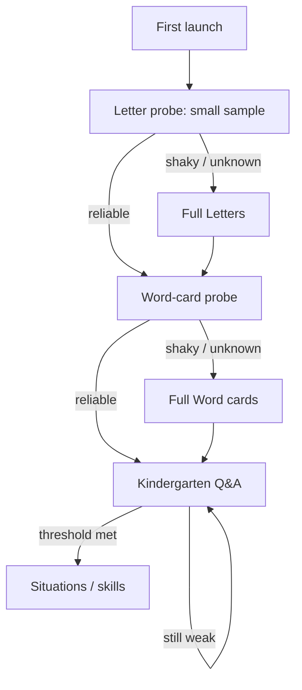

# Onboarding from zero

Assume nothing: no English, no Latin alphabet.

Screens: [SCREENS.md](SCREENS.md). Stages: [BUILD.md](BUILD.md) stages 0–2.

## Step A — Letters

One card: the Latin sign + a Cyrillic hint of the rough sound. The goal is to *picture* the sound, not to become a phonetician.

## Step B — First matches

Cards with the word in the learner’s language and in Latin/English side by side.

Example already chosen: `верх` / `top`.

Same pattern for the kindergarten set: down, left, right, day, night, morning, evening, hour/clock.

## Step C — Kindergarten Q&A

Short questions and answers on those pairs. Still no generated conversation.

## Step D — Ramp

From these card sets the course picks up and raises difficulty. Situation tracks come after the person can read the working words.

## Fast path

A learner who already maps the letters and the first words should not be forced to sit in A–C. Measure and skip.

**Decision:** “reliable” on a probe means ≥ 90% correct on a fixed 8–12 item sample in one sitting, with no hint spend. Thresholds are constants in `domain`, not per-user narrative flags.
