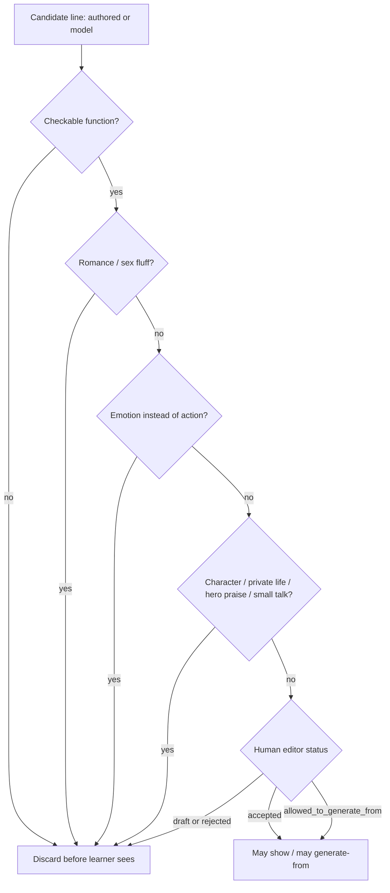

# Pedagogy, frames, filter

## A phrase is a tool

For every line in the course, three questions must have answers:

1. What does the person want to get?
2. What must the other person understand?
3. What counts as done?

If any answer is “atmosphere” or “feelings,” drop the line.

## Frame

A frame is a skeleton with holes:

`How much is this ___ ?`  
`I need ___ for two loads.`  
`This ___ does not work.`

The lesson trains the skeleton, then swaps the object. That is the “same frame, other thing” drill.

Authoring schemas: [DATA.md](DATA.md).

## Error

Show the broken slot. Show the working phrase. Do not console. Do not invent a story about why they missed it.

Screen: [SCREENS.md](SCREENS.md#error--broken-slot).

## Review

Schedule from real mistakes (this user, this skill, this word), not from a fixed chapter list.

## Fluff filter (must stay mechanical)

Reject a generated or authored line if:

- no checkable function;
- romantic or sexual fluff;
- the product offers an emotion instead of an action;
- a character is being built;
- the model asks about private life or jokes about relationships;
- the user is praised as a hero;
- the talk has become small talk.

A human editor is the last gate. Status on each item: draft / rejected / accepted / allowed-to-generate-from.

**Decision:** filter runs **before** UI binding. Goal-dialogue transcripts never append a discarded turn. Architecture layer: `ai-filter` in [ARCHITECTURE.md](ARCHITECTURE.md).

## Stars and hints

Stars are a quiet reward. They convert into a hint. They are not a social league.

Rate (documented in [DATA.md](DATA.md)): **5 stars = 1 hint** until playtests change it.

## Placement

If the person already knows the early material, do not trap them. Let them pass 0–2 fast. See [ONBOARDING.md](ONBOARDING.md).
