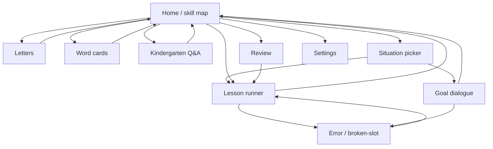

# Screens and navigation

**Docs only.** Dry black-and-grey UI. No characters, leagues, memes, or plot chrome. Copy for chrome and errors: Russian. Drill content: English (with Russian task text).

Single-activity app; destinations below are navigation routes.

## Navigation

**Decision:** back always returns to the previous non-modal screen; Error is a child of Lesson/Goal, not a top-level habit destination.

---

## Home / skill map

| | |
| --- | --- |
| **Purpose** | Show skill reliability and offer one short next action |
| **Inputs** | Progress markers per skill; streak; stars; review-queue count |
| **Outputs** | Navigate to Letters / Words / Kindergarten / Lesson / Review / Situations / Settings |
| **Empty state** | First launch: only onboarding path highlighted (“Буквы”); map nodes beyond letters are locked grey until letters+cards gate opens |

Markers on the map: `unseen` / `weak` / `review` / `done`. Reminder deep-link targets **one skill action**, never a story chapter.

---

## Letters

| | |
| --- | --- |
| **Purpose** | Latin letter + Cyrillic sound hint; mark seen / shaky / known |
| **Inputs** | Letter pack; per-letter local state |
| **Outputs** | Updated letter progress; optional stars |
| **Empty state** | If pack missing: “Нет данных букв” + link to rebuild content (dev); learner never sees network error for bundled pack |

No account. No plot.

---

## Word cards

| | |
| --- | --- |
| **Purpose** | Bilingual matches (`верх` / `top` and kindergarten set) |
| **Inputs** | Card pack; known/shaky state; fast-path test result |
| **Outputs** | Card progress; stars; unlock signal for Kindergarten |
| **Empty state** | “Нет карточек” only if pack absent; otherwise always show next card |

Fast path: if learner matches a probe set reliably, skip remaining easy cards (see [ONBOARDING.md](ONBOARDING.md)).

---

## Kindergarten Q&A

| | |
| --- | --- |
| **Purpose** | Short Q&A on up/down, left/right, day/night, morning/evening, clock — no generated dialogue |
| **Inputs** | Fixed Q&A items; progress |
| **Outputs** | Unlock situation tracks when threshold met; stars |
| **Empty state** | Locked from Home until word-card gate passes; if opened early, show gate message in Russian |

---

## Lesson runner

| | |
| --- | --- |
| **Purpose** | Few-minute drill for **one** skill: assemble, substitute, choose, listen, speak, fill-gap |
| **Inputs** | `skillId`; skill JSON; optional role context; stars/hints balance |
| **Outputs** | Step results; progress update; review-queue entries; navigate to Error on fail |
| **Empty state** | If skill not `accepted` / `allowed_to_generate_from`: do not open; toast “Умение ещё не в курсе” |

Task line always Russian. Working phrases English. Hint button spends stars per [DATA.md](DATA.md).

---

## Error / broken-slot

| | |
| --- | --- |
| **Purpose** | Show which frame element broke + the correct working phrase. No comfort story |
| **Inputs** | `brokenSlotId` or mismatch note; `workingPhrase`; skill/frame ids |
| **Outputs** | Retry step or continue; schedule review item |
| **Empty state** | Should not open without a failure payload; if it does, pop back to Lesson |

UI: dry. Label the slot. Show correct line. One primary button: “Дальше” / “Ещё раз”.

---

## Review

| | |
| --- | --- |
| **Purpose** | Drill items this user actually confuses (skills, slots, words) |
| **Inputs** | `reviewQueue` due items |
| **Outputs** | Updated markers; dequeue on success |
| **Empty state** | “Пока нечего повторять” + link Home |

Not a chapter list. Order by due time and weakness, not by novel order.

---

## Situation picker

| | |
| --- | --- |
| **Purpose** | Choose a life situation (shop, travel, tech, household) — roles as goals, not characters |
| **Inputs** | Role pack; unlocked skills; tech framing rules |
| **Outputs** | Start Lesson for linked skills or Goal dialogue |
| **Empty state** | If no roles unlocked: “Сначала база букв и слов” |

Tech roles list working path (Linux/Windows/Android). Apple only as dismissed poor gear in content, not as a product setting.

---

## Goal dialogue

| | |
| --- | --- |
| **Purpose** | Short multi-turn dialogue **only** with an external goal (ticket, storage period, replace item, where to go, call help, “I feel unwell”) |
| **Inputs** | Role goal; allowed frames; bans; model backend (online or offline) |
| **Outputs** | Turn results through `ai-filter`; progress; Error on frame break |
| **Empty state** | If no model and offline: “Нет модели. Скачайте офлайн-модель в Настройках или включите сеть.” Never fall back to unfiltered chat |

Discarded fluff never reaches the transcript UI.

---

## Settings (offline model button)

| | |
| --- | --- |
| **Purpose** | One-button download/remove of optional open offline model; notification toggle for one-action reminders |
| **Inputs** | Network for download; disk space; install state |
| **Outputs** | `offlineModelInstalled`; reminder preference |
| **Empty state** | Button label: “Скачать офлайн-модель” when not installed; progress + cancel while downloading; “Удалить офлайн-модель” when installed |

No account screen in v1. No social. No theme skins beyond black-and-grey.

---

## Shared UI rules

- Background near-black; text light grey; one accent grey for primary actions.
- No character avatars, streak flames-as-mascots, or league pods.
- Errors never apologize with a narrative; they name the broken slot.

## Related docs

- Architecture: [ARCHITECTURE.md](ARCHITECTURE.md)
- Data: [DATA.md](DATA.md)
- Onboarding: [ONBOARDING.md](ONBOARDING.md)
